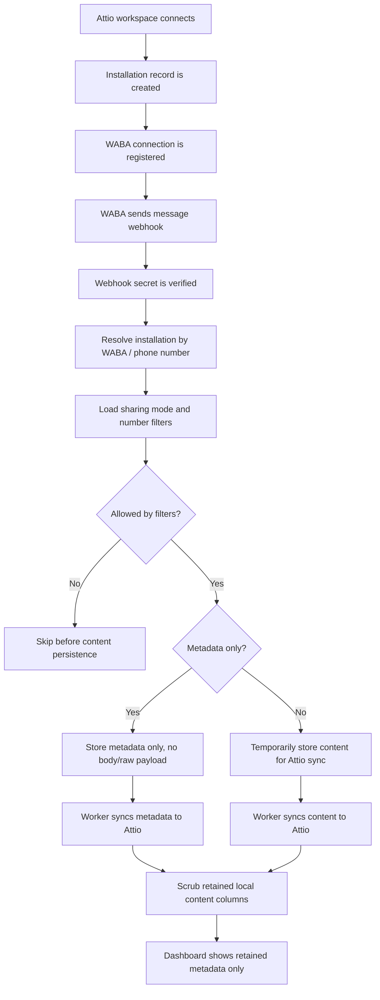

# Attio WhatsApp CRM

Attio WhatsApp CRM connects a WhatsApp Business account to an Attio workspace so
customer conversations can be synced into CRM records without permanently
retaining message content in the app database.

The app is built around a Hono API, React dashboard, Drizzle-managed SQLite/Turso
schema, and a background worker that syncs approved WhatsApp events into Attio.

## What It Does

- Connect an Attio workspace with OAuth.
- Register a WhatsApp Business Account connection.
- Receive WABA message events through authenticated webhook routes.
- Sync WhatsApp conversation metadata and, when enabled, message text into Attio.
- Respect workspace-level sharing settings:
  - `full_access`: sync message body to Attio, then scrub local DB content.
  - `metadata_only`: never persist message body/raw payload locally.
- Respect include/exclude phone-number filters before storing message content.
- Encrypt stored Attio and WhatsApp connection credentials.

## WABA App Flow



## Message Content Retention

The database keeps the WhatsApp message row for traceability, but message content
is removed after processing. The cleanup does not delete the whole row; it clears
content-bearing columns such as `text_body`, `raw_message_json`, media fields,
and location fields.

Reviewer entry points:

- WABA webhook ingestion and privacy settings:
  `apps/attio/server/services/waba-sync.ts`
- Message sync to Attio:
  `apps/attio/server/services/attio-sync.ts`
- Content scrubbing after sync/filter/retention:
  `apps/attio/server/db/queries/whatsapp-messages.ts`
- Nullable raw payload column:
  `apps/attio/server/db/schema.ts`

Important functions:

- `shouldFilterPhone(...)` in `apps/attio/server/services/waba-sync.ts`
  applies include/exclude filters before content is inserted.
- `metadataOnly` handling in `apps/attio/server/services/waba-sync.ts`
  stores no message body and no raw webhook payload when the workspace chooses
  metadata-only mode.
- `markWhatsappMessageSynced(...)` and `markWhatsappMessageFiltered(...)` in
  `apps/attio/server/db/queries/whatsapp-messages.ts` keep the message row but
  scrub content columns.
- `scrubExpiredWhatsappMessages(...)` in
  `apps/attio/server/db/queries/whatsapp-messages.ts` clears content from
  pending/failed rows after the configured retention window.

## Credential Encryption

Stored credentials are encrypted at the query boundary before they are written to
the database, then decrypted after reads so the rest of the app works with normal
JSON objects in memory.

Reviewer entry points:

- Encryption helper: `apps/attio/server/lib/encryption.ts`
- Attio OAuth token storage: `apps/attio/server/db/queries/installations.ts`
- WhatsApp session credential/key storage:
  `apps/attio/server/db/queries/whatsapp-session-auth.ts`

Encrypted fields:

- `installations.auth_json`
- `whatsapp_session_creds.creds_json`
- `whatsapp_session_keys.value_json`

Production requires `APP_DATA_ENCRYPTION_KEY`. If it is missing in production,
credential writes fail instead of silently storing plaintext.

## Main Directories

```text
apps/
  attio/
    frontend/   React dashboard
    server/     Hono API, WABA routes, Attio sync worker, persistence
    shared/     Request/response schemas shared by frontend and server
```

## Common Commands

```sh
bun install
bun run dev
bun run lint
bun run typecheck
bun run test
```

When working on the app directly:

```sh
cd apps/attio
bun run dev
bun run lint
bun run typecheck
```

## Environment

Core production settings:

- `APP_SESSION_SECRET`
- `APP_DATA_ENCRYPTION_KEY`
- `ATTIO_CLIENT_ID`
- `ATTIO_CLIENT_SECRET`
- `ATTIO_REDIRECT_URI`
- `ATTIO_OAUTH_STATE_SECRET`
- `WABA_RELAY_SECRET`
- `DATABASE_URL`
- `TURSO_AUTH_TOKEN`

Message-content retention is controlled by:

- `WHATSAPP_MESSAGE_RETENTION_HOURS`

The default is `24` hours for pending/failed rows. Synced and filtered rows are
scrubbed immediately by the worker path.

## Database Workflow

Schema changes are manual. Build and deploy commands do not automatically run
database migration or push commands.
